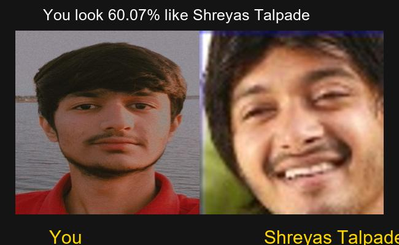

# 🎭 Bollywood Celebrity Lookalike Finder 🎮

A fun and interactive web app that uses deep learning to tell you which Bollywood celebrity you resemble! Upload your photo and instantly get matched with a star, along with your resemblance percentage and a beautiful side-by-side comparison image.

## 🚀 Features

- 🔍 *Face Detection* using MTCNN
- 🤖 *Feature Extraction* with VGGFace (ResNet50 backend)
- 📊 *Similarity Calculation* using Cosine Similarity
- 🧠 Pre-trained embeddings for fast results
- 🎨 Side-by-side image generation with resemblance score
- 📅 Downloadable comparison image
- 📢 Shareable results

## 📦 Tech Stack

- *Frontend*: Streamlit
- *Backend*: Python
- *Face Detection*: MTCNN
- *Feature Extraction*: VGGFace (ResNet50)
- *Similarity Metric*: Scikit-learn (Cosine Similarity)
- *UI Enhancements*: PIL, Custom CSS

## 🖼 Sample Output

  

## 📁 Project Structure

├── app.py                  # Main Streamlit app
├── embedding.pkl           # Precomputed facial embeddings
├── filenames.pkl           # Corresponding celebrity image paths
├── uploads/                # Uploaded user images
├── comparison_results/     # Output comparison images
├── requirements.txt        # Project dependencies

## ⚙ Setup Instructions

1. *Clone the Repository*
   bash
   git clone https://github.com/maharshijani05/BollywoodCeleb-Lookalike-Finder.git
   cd bollywood-lookalike-finder
   

2. *Create & Activate Virtual Environment*
   bash
   python -m venv venv
   source venv/bin/activate      # On Windows: venv\Scripts\activate
   

3. *Install Dependencies*
   bash
   pip install -r requirements.txt
   

4. *Run the App*
   bash
   streamlit run app.py
   

## 📝 Requirements

Make sure you have the following installed:

- Python >= 3.7
- Streamlit
- TensorFlow / Keras
- MTCNN
- OpenCV
- NumPy, Pillow, Scikit-learn
- pyperclip

> The celebrity embeddings and image dataset should already be available via embedding.pkl and filenames.pkl.

## 📣 Credits

- Pretrained VGGFace model from [keras-vggface](https://github.com/rcmalli/keras-vggface)
- MTCNN Face Detector from [ipazc/mtcnn](https://github.com/ipazc/mtcnn)

---

*Made with ❤ by Maharshi Jani*
